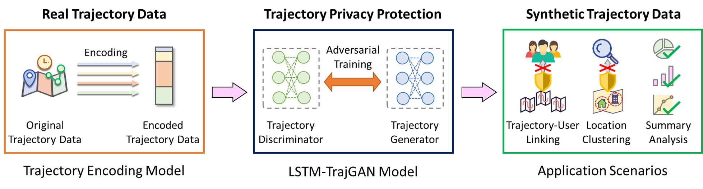
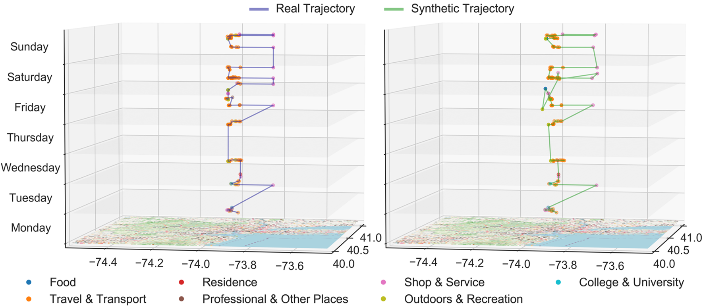
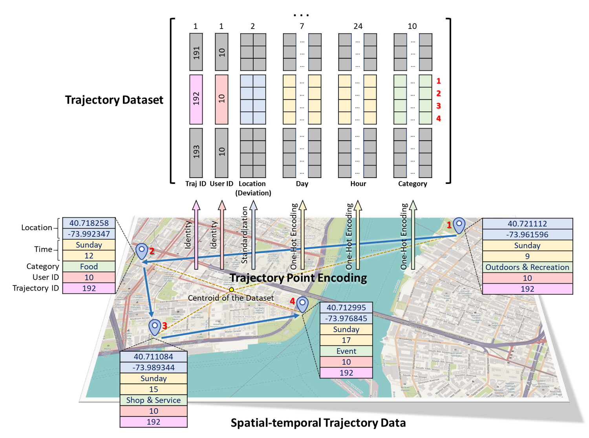

# LSTM-TrajGAN

LSTM-TrajGAN: A Deep Learning Approach to Trajectory Generation and Privacy Protection

## Abstract
The prevalence of location-based services contributes to the explosive growth of individual-level location trajectory data and raises public concerns about privacy issues. In this research, we propose a novel LSTM-TrajGAN approach, which is an end-to-end deep learning model to generate privacy-preserving synthetic trajectory data for data sharing and publication. We design a loss metric function TrajLoss to measure the trajectory similarity losses for model training and optimization. The model is evaluated on the trajectory-user-linking task on a real-world semantic trajectory dataset. Compared with other common geomasking methods, our model can better prevent users from being re-identified, and it also preserves essential spatial, temporal, and thematic characteristics of the real trajectory data. The model better balances the effectiveness of trajectory privacy protection and the utility for spatial and temporal analyses, which offers new insights into the GeoAI-powered privacy protection for human mobility studies.

<p align="center">
    
</p>
<p align="center">
    
</p>

## Reference
If you find our code or ideas useful for your research, please cite our paper:

*Rao, J., Gao, S.\*, Kang, Y. and Huang, Q. (2020). [LSTM-TrajGAN: A Deep Learning Approach to Trajectory Privacy Protection](https://drops.dagstuhl.de/opus/volltexte/2020/13047/). In the Proceedings of the 11th International Conference on Geographic Information Science (GIScience 2021), 12:1--12:17.*

```
@InProceedings{rao_et_al:LIPIcs:2020:13047,
  author =	{Jinmeng Rao and Song Gao and Yuhao Kang and Qunying Huang},
  title =	{{LSTM-TrajGAN: A Deep Learning Approach to Trajectory Privacy Protection}},
  booktitle =	{11th International Conference on Geographic Information Science (GIScience 2021) - Part I},
  pages =	{12:1--12:17},
  series =	{Leibniz International Proceedings in Informatics (LIPIcs)},
  ISBN =	{978-3-95977-166-5},
  ISSN =	{1868-8969},
  year =	{2020},
  volume =	{177},
  editor =	{Krzysztof Janowicz and Judith A. Verstegen},
  publisher =	{Schloss Dagstuhl--Leibniz-Zentrum f{\"u}r Informatik},
  address =	{Dagstuhl, Germany},
  URL =		{https://drops.dagstuhl.de/opus/volltexte/2020/13047},
  URN =		{urn:nbn:de:0030-drops-130471},
  doi =		{10.4230/LIPIcs.GIScience.2021.I.12},
  annote =	{Keywords: GeoAI, Deep Learning, Trajectory Privacy, Generative Adversarial Networks}
}
```

## Related work
*Rao, J., Gao, S.\*, and Zhu, S. (2023). [CATS: Conditional Adversarial Trajectory Synthesis for privacy-preserving trajectory data publication using deep learning approaches](https://www.tandfonline.com/doi/abs/10.1080/13658816.2023.2262550). In International Journal of Geographical Information Science, 37:12,2538--2574.

```
@article{rao2023cats,
  title={CATS: Conditional Adversarial Trajectory Synthesis for privacy-preserving trajectory data publication using deep learning approaches},
  author={Rao, Jinmeng and Gao, Song and Zhu, Sijia},
  journal={International Journal of Geographical Information Science},
  volume={37},
  number={12},
  pages={2538--2574},
  year={2023},
  publisher={Taylor \& Francis}
}
```


## Requirements

LSTM-TrajGAN uses the following packages with Python 3.6.3

- numpy==1.18.4
- pandas==1.1.5
- tensorflow-gpu==1.13.1
- Keras==2.2.4
- geohash2==1.1
- scikit-learn==0.23.2

## Usage

### Data Encoding
<p align="center">
    
</p>

Convert csv files to one-hot-encoded npy files.

```
python data/csv2npy.py --load_path dev_train_encoded_final.csv --save_path train_encoded.npy --tid_col tid
```

Where `load_path` is the path to csv file, `save_path` is the path to save npy file, `tid_col` is the column name of trajectory id.

### Training

Train the LSTM-TrajGAN model using the preprocessed data.

```
python train.py 2000 256 100
```

Where `2000` is the total training epochs, `256` is the batch size, `100` is the parameter saving interval (i.e., save params every 100 epochs).

### Prediction

Generate synthetic trajectory data based on the real test trajectory data and save them to `results/syn_traj_test.csv`.

```
python predict.py 1900
```

Where `1900` means we load the params file saved at the 1900th epoch to generate synthetic trajectory data.

### Test

Evaluate the synthetic trajectory data on the Trajectory-User Linking task using MARC.

```
python TUL_test.py data/train_latlon.csv results/syn_traj_test.csv 100
```

Where `data/train_latlon.csv` is the training data, `results/syn_traj_test.csv` is the synthetic test data, `100` is the embedder size.

### Dataset

The data we used in our paper originally come from [the Foursquare NYC check-in dataset](https://sites.google.com/site/yangdingqi/home/foursquare-dataset).

### References

We mainly referred to these two works:

*May Petry, L., Leite Da Silva, C., Esuli, A., Renso, C., and Bogorny, V. (2020). MARC: a robust method for multiple-aspect trajectory classification via space, time, and semantic embeddings. International Journal of Geographical Information Science, 34(7), 1428-1450.* [Github](https://github.com/bigdata-ufsc/petry-2020-marc)

*Keras-GAN: Collection of Keras implementations of Generative Adversarial Networks (GANs).* [Github](https://github.com/eriklindernoren/Keras-GAN)

## Model Improvements: Reward Function Effectiveness

The reward function has been enhanced to achieve better training stability and balance between privacy, utility and realism objectives:

### 1. Balanced Reward Components

- **Adjusted Weights**: The weights for adversarial (w_adv=0.7), utility (w_util=0.5), and privacy (w_priv=0.2) components are now better balanced to prevent any single component from dominating training.
- **Utility Component Balance**: We've rebalanced spatial (0.6), temporal (0.3), and category (0.3) utility weights to prevent spatial utility from overwhelming other considerations.

### 2. Reward Normalization

- **Dynamic Normalization**: Each utility reward component (spatial, temporal, category) is normalized using running statistics to maintain similar scales throughout training.
- **Adversarial Reward Normalization**: The discriminator-based adversarial reward is normalized to match the scale of utility rewards.
- **Monitoring Stats**: Detailed tracking of normalization parameters to monitor reward component balance over time.

### 3. Training Dynamics Improvements

- **Multiple Generator Updates**: The generator is updated multiple times (default: 2) per discriminator update to help it catch up when the discriminator is learning too quickly.
- **Optimized Learning Rates**: Reduced discriminator learning rate (0.0001) relative to generator (0.0005) to prevent discriminator dominance.
- **Gradient Clipping**: All optimizers use gradient clipping to prevent extreme updates.

### 4. Comprehensive Monitoring

- **Component Contributions**: Visualization of each reward component's relative contribution to the total reward.
- **Original vs. Normalized Values**: Tracking of both raw and normalized reward values to assess normalization effectiveness.
- **Training Balance Metrics**: Monitoring generator-to-discriminator loss ratios and discriminator classification behavior.
- **Utility Subcomponent Analysis**: Detailed breakdown of spatial, temporal, and category contributions to utility.

### 5. Dynamic Clip Limits for Temporal and Category Components

- **Gradual Limit Increase**: Clip limits for temporal and category losses now dynamically increase over training to allow for more detailed gradient information.
- **Configurable Parameters**: Initial limits start at 10.0 and can increase up to 30.0 for temporal and 20.0 for category components.
- **Scheduled Adjustments**: Clip limits start increasing after epoch 100 and adjust every 20 epochs.
- **Tracking Utilization**: Monitoring what percentage of the clip limit is being used to identify when increases are needed.

### 6. Curriculum Learning for Utility Component Weights

- **Progressive Focus Shift**: Training begins with higher emphasis on spatial accuracy (0.8) and lower weights for temporal (0.2) and category (0.2) components.
- **Gradual Transition**: Component weights gradually adjust toward target values (0.6, 0.3, 0.3) over 200 epochs starting from epoch 50.
- **Adaptive Learning**: This approach allows the model to master spatial aspects first before focusing on the more challenging temporal and categorical dimensions.
- **Comprehensive Monitoring**: Tracking of curriculum progress and component weight changes in wandb.

### 7. Multi-Metric Early Stopping

- **Balanced Evaluation**: Rather than relying solely on generator loss, the model now monitors multiple metrics for early stopping:
  - **Generator Loss**: Traditional measure of generator performance
  - **Reward Balance Score**: How evenly balanced the reward components are (adversarial, utility, privacy)
  - **Utility Improvement Trend**: Whether utility components are showing consistent improvement
  - **Privacy Score**: How well privacy is being preserved (based on TUL classifier accuracy)
- **Metric-Specific Best Models**: The system saves separate "best" models for each metric category
- **Consensus-Based Stopping**: Training stops when multiple criteria (at least 3) suggest no improvement for the specified patience period
- **Smart Selection**: Upon stopping, the model selects the best overall checkpoint based on the most recent "best" across all metrics

## Usage

Train the model with the enhanced reward function:

```python
python train.py
```

Monitor training progress in Weights & Biases to observe:
- Overall reward component balance
- Adversarial reward effectiveness
- Utility component contributions
- TUL classifier accuracy (privacy effectiveness)
- Normalization statistics over time
- Dynamic clip limit adjustments
- Curriculum learning progress
- Multiple early stopping metrics
